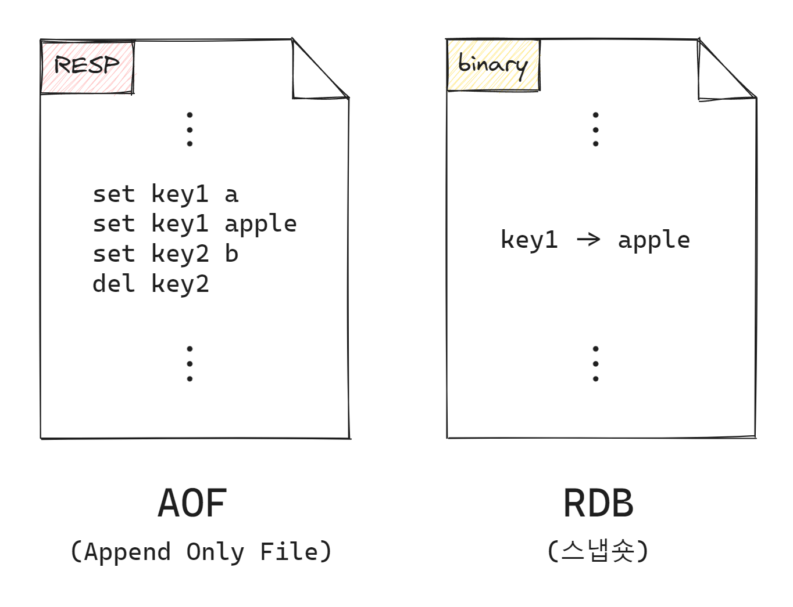

# intellij

### **Intellij에서 CamelCase 단어 별로 선택하기**

Preferences -> Editor -> General -> Smart Keys 에서 User "CamelHumps" words 옵션을 체크


### 터미널 한글 깨짐 현상 해결

1. Settings -> Editor -> File Encodings ->  전부 UTF-8로 변경
2.  Help -> Edit Custom VM Options ... 에 아래 코드 추가.

    ```
    -Dfile.encoding=UTF-8
    -Dconsole.encoding=UTF-8
    ```
3.  C:\Program Files\JetBrains\IntelliJ IDEA 2024.1\bin 에 아래 코드 추가.

    ```
    -Dfile.encoding=UTF-8
    -Dconsole.encoding=UTF-8
    ```


4.

    <figure><figcaption></figcaption></figure>


5.

    <figure><figcaption></figcaption></figure>


### 윈도우 맥 CRLF와 LF 차이 에러나는거 해결하기

내가 윈도우 일때 파일들이crlf로 다운이 받아지는 문제가 발생함.

```
git config --global core.eol lf
git config --global core.autocrlf input
```

* 위와같이 터미널에 입력한 뒤,
* 프로젝트를 다시 받으면 lf로 받아진다.


### 단축키 알림 툴

* key promoter 설치 (단축키알림)
* Presentation Assistant 설치 (알림을 예쁘게 보여줌)


### Auto Import 자동으로 임포트 하기

<figure><figcaption></figcaption></figure>


### CamelCase 플러그인 원하는 형식만 사용하도록 설정하기

<figure><figcaption></figcaption></figure>


<figure><figcaption></figcaption></figure>
